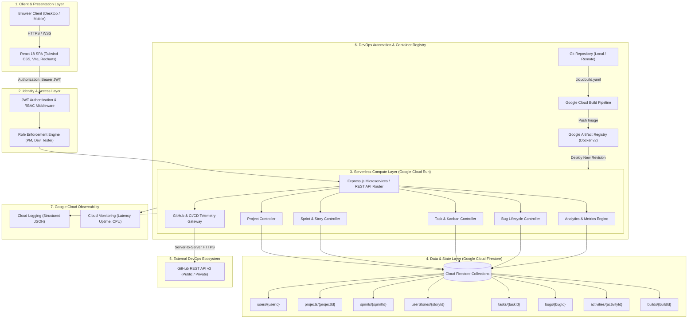

# DevTrack — System Architecture & Cloud Engineering Design

This document details the architectural specifications, system topology, component interactions, and cloud deployment boundaries for **DevTrack**.

---

## 1. High-Level Architectural Diagram



---

## 2. Architectural Design Principles

### 2.1 Scale-to-Zero Serverless Philosophy
To satisfy strict academic constraints and safeguard the Google Cloud Free Trial credits:
* All compute instances run within **Google Cloud Run** configured with `minScale: 0`.
* Idle periods incur **$0.00 compute charges**.
* Startup concurrency is handled via Google's instant container scheduling with startup CPU boost enabled.

### 2.2 Dual-Mode Hybrid Persistence Layer
The repository layer (`FirestoreRepository`) implements an adaptive persistence interface:
1. **Google Cloud Firestore Mode**: When valid GCP service credentials exist, the client communicates directly with Google Cloud Firestore NoSQL collections.
2. **Local / Emulator Mode**: When network access is restricted or GCP billing is temporarily locked, an in-memory file-backed JSON store provides uninterrupted CRUD fidelity. This eliminates single-point-of-failure risks during live academic grading.

### 2.3 Strict Backend Authorization Boundary
Unlike prototypes that only hide UI buttons, DevTrack enforces authorization at the HTTP route level:
* Every incoming request executes `authenticate()` to verify signature integrity, expiration, and user existence.
* Administrative routes execute `authorize('PROJECT_MANAGER')` before invoking controller logic.
* Non-permitted operations return standard `403 Forbidden` JSON payloads with explanatory context.

### 2.4 Token Shielding & GitHub API Abstraction
Frontend clients never communicate directly with the GitHub API using personal access tokens. Instead:
* The backend acts as a secure reverse proxy.
* Credentials remain isolated on the server side (environment variables or Google Secret Manager).
* GitHub rate limits and connection errors gracefully degrade to realistic cached repository telemetry.

---

## 3. Database Schema Topology

```
Root
├── users/ (User accounts, bcrypt hashes, roles, avatars)
├── teams/ (Engineering teams, membership rosters, permissions)
├── projects/ (Software projects, managers, progress metrics, Git URLs)
├── sprints/ (Time-boxed iterations, goals, velocities, dates)
├── userStories/ (Product backlog items, acceptance criteria, story points)
├── tasks/ (Work items, status columns, assignees, estimates)
├── bugs/ (Defects, reproduction steps, severities, resolutions)
├── activities/ (Immutable audit trail log events)
├── notifications/ (User alert events and deep links)
└── builds/ (CI/CD pipeline execution logs and outcomes)
```

---

## 4. Network and Security Boundaries

1. **Transport Layer Security**: All communications over HTTPS with TLS 1.3.
2. **Content Security & HTTP Hardening**: Enforced via Express `helmet` middleware.
3. **CORS Governance**: Configured to restrict unauthorized cross-origin requests.
4. **Least-Privilege Cloud IAM**: Cloud Run runs under a dedicated service account (`devtrack-sa`) possessing only `roles/datastore.user`, `roles/logging.logWriter`, and `roles/monitoring.metricWriter`.
