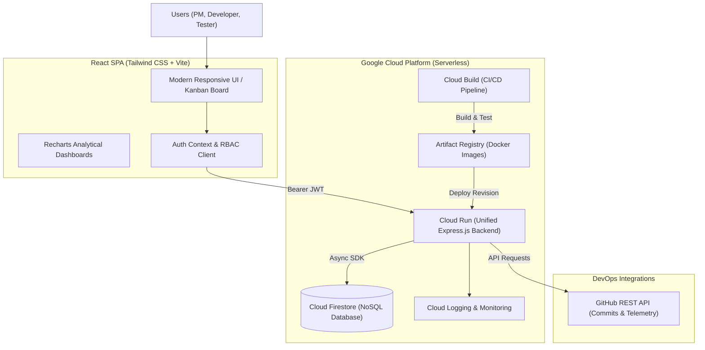

# DevTrack — Integrated Software Project Management System

[](https://cloud.google.com)
[](https://www.typescriptlang.org/)
[](https://react.dev)
[](https://nodejs.org)
[](https://expressjs.com)
[](https://vitejs.dev)
[](https://tailwindcss.com)

> **M.Tech Software Engineering / Cloud Computing Academic Project**  
> An integrated, cloud-native software engineering lifecycle management platform running on **Google Cloud Platform (GCP)**.

---

## 1. Executive Summary & Problem Statement

Software development teams frequently juggle disconnected tools for task tracking, sprint backlogs, bug tracking, code repositories, and deployment pipelines. This fragmentation leads to:
* Blind spots in end-to-end development progress.
* Coordination friction between Project Managers, Developers, and QA Testers.
* Desynchronization between code commits and issue statuses.
* Disjointed deployment visibility and manual verification bottlenecks.

**DevTrack** addresses this challenge by providing a centralized platform unifying:
1. **Agile Methodology & Scrum**: Sprints, Product Backlog, and User Stories with Story Points.
2. **Interactive Task Management**: Real-time 5-column Kanban board (`TO DO` &rarr; `IN PROGRESS` &rarr; `REVIEW` &rarr; `TESTING` &rarr; `COMPLETED`).
3. **Defect Tracking Lifecycle**: Defect reporting, reproduction steps, severity categorization, fix verification, and closure.
4. **DevOps & GitHub Integration**: Live commit telemetry and repository synchronization without client token exposure.
5. **CI/CD Pipeline Monitoring**: Google Cloud Build pipeline stages, build history, and manual trigger triggers.
6. **Executive Dashboards & Analytics**: Quantitative metrics visualized with Recharts (velocity, completion rates, resolution ratios).

---

## 2. Architecture Overview



---

## 3. Technology Stack

| Layer | Technologies | Justification |
| :--- | :--- | :--- |
| **Frontend** | React 18, TypeScript, Vite, Tailwind CSS, Recharts, Lucide Icons | High-performance SPA with type safety, modern aesthetics, and interactive analytical charts. |
| **Backend** | Node.js (v24 LTS), TypeScript, Express.js, JWT, bcryptjs | Clean REST API with asynchronous I/O and strict Role-Based Access Control (RBAC). |
| **Database** | Google Cloud Firestore (with local fallback layer) | Serverless NoSQL document database providing low latency, indexing, and scale-to-zero. |
| **Compute** | Google Cloud Run | Fully managed containerized runtime configured with `--min-instances=0` for free-tier optimization. |
| **CI/CD** | Google Cloud Build (`cloudbuild.yaml`) | Multi-stage automated pipeline enforcing test pass criteria before deployment. |
| **Registry** | Google Artifact Registry | Private, secure Docker container repository in `asia-south1`. |
| **Observability**| Google Cloud Logging & Monitoring | Centralized telemetry for cold-start latency, error rates, and request counts. |

---

## 4. Role-Based Access Control (RBAC) Matrix

DevTrack strictly enforces authorization boundaries on both frontend UI and backend API routes:

| Feature / Action | Project Manager (`PM`) | Developer (`DEV`) | Tester (`QA`) |
| :--- | :---: | :---: | :---: |
| Create / Edit / Delete Projects | :white_check_mark: | :x: (403 Forbidden) | :x: (403 Forbidden) |
| Manage Teams & Assign Roles | :white_check_mark: | :x: | :x: |
| Plan Sprints & Manage Backlog | :white_check_mark: | :x: (Read-only) | :x: (Read-only) |
| Create Tasks & Assign Engineers | :white_check_mark: | :white_check_mark: | :x: |
| Transition Kanban Task Status | :white_check_mark: | :white_check_mark: | :white_check_mark: |
| Report New Bugs / Defects | :white_check_mark: | :white_check_mark: | :white_check_mark: |
| Fix Bugs & Add Resolution Notes | :white_check_mark: | :white_check_mark: | :x: |
| Verify Bug Fixes & Close Defect | :white_check_mark: | :x: | :white_check_mark: |
| Trigger CI/CD Cloud Build | :white_check_mark: | :x: | :x: |

---

## 5. Pre-Seeded Academic Demo Accounts

For instant academic evaluation, the system includes pre-seeded demo personas (`password123` for all):

* **Sarah Chen** (`pm@devtrack.io`) — *Lead Project Manager*
* **Alex Rivera** (`dev@devtrack.io`) — *Full Stack Developer*
* **Priya Sharma** (`tester@devtrack.io`) — *QA & Test Engineer*

*Note: The UI includes a 1-click Demo Switcher in the top navigation bar to seamlessly simulate multi-user role interactions during presentations.*

---

## 6. Quick Start & Local Execution

### Prerequisites
* Node.js v20+ or v24 LTS
* Git

### Step-by-Step Commands
```bash
# 1. Clone repository
git clone <repo-url> devtrack
cd devtrack

# 2. Automated setup (installs dependencies, builds frontend, seeds demo database)
# Windows PowerShell:
.\scripts\setup-local.ps1

# Linux / macOS / WSL:
chmod +x scripts/*.sh
./scripts/setup-local.sh

# 3. Start Application
# Option A: Fullstack unified server (serves frontend + API on port 8080)
cd backend
npm run build
npm start
# Visit http://localhost:8080

# Option B: Development mode with hot-reloading
# Terminal 1: Backend
cd backend && npm run dev
# Terminal 2: Frontend
cd frontend && npm run dev
# Visit http://localhost:3000
```

---

## 7. Automated Testing Suite

DevTrack includes comprehensive unit, integration, and security tests:

```bash
cd backend
npm test
```

### Test Coverage Highlights:
* **Health & Probes**: Validates uptime, GCP connectivity metadata, and JSON structure.
* **Authentication**: Password hashing with salt, JWT token generation, 401 unauthorized rejection.
* **RBAC Enforcement**: Confirms 403 Forbidden when a Developer attempts project deletion or creation.
* **Agile Sprint & Backlog**: CRUD verification and automated progress calculations (`completedTasks / totalTasks * 100`).
* **Task Workflow**: End-to-end status progression (`TO DO` &rarr; `IN PROGRESS` &rarr; `COMPLETED`).
* **Bug Lifecycle**: Defect resolution workflow (`OPEN` &rarr; `FIXED` &rarr; `CLOSED`).
* **Telemetry**: Validates GitHub commit ingestion and Cloud Build pipeline history.

---

## 8. Google Cloud Deployment

DevTrack includes production deployment scripts and a declarative `cloudbuild.yaml`:

```bash
# PowerShell
.\scripts\deploy-gcp.ps1 -ProjectId "YOUR_PROJECT_ID" -Region "asia-south1"

# Linux / Bash
./scripts/deploy-gcp.sh "YOUR_PROJECT_ID" "asia-south1"
```

### Resource Cleanup (Post-Demo)
To ensure zero lingering costs after your academic evaluation:
```bash
.\scripts\cleanup.ps1
```

---

## 9. Academic Project Metadata
* **Student Program**: Master of Technology (M.Tech) in Software Engineering / Cloud Computing
* **Coursework Focus**: Distributed Systems, Cloud Architecture, DevOps & Agile Methodologies
* **Platform Target**: Google Cloud Platform (GCP)
